# Architecture

How recruit-me is put together, and why the seams are where they are.

If you read one thing, read [Three kinds of file](#three-kinds-of-file). Every
other decision follows from it.

**Contents**

1. [Three kinds of file](#three-kinds-of-file)
2. [Directory structure](#directory-structure)
3. [The content model](#the-content-model)
4. [From YAML to a typed module](#from-yaml-to-a-typed-module)
5. [The build pipeline](#the-build-pipeline)
6. [One corpus, five derivations](#one-corpus-five-derivations)
7. [Runtime: routing and the client](#runtime-routing-and-the-client)
8. [A request at the edge](#a-request-at-the-edge)
9. [Fit](#fit)
10. [Search](#search)
11. [The knowledge graph](#the-knowledge-graph)
12. [The design system](#the-design-system)
13. [Security model](#security-model)
14. [Gates and tests](#gates-and-tests)
15. [Extension recipes](#extension-recipes)
16. [Deployment](#deployment)
17. [Where decisions are recorded](#where-decisions-are-recorded)

---

## Three kinds of file

Every file in the repo is exactly one of these, and the boundaries are
enforced by gates rather than convention.

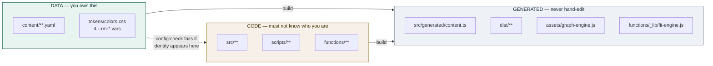

The consequence: **adopting this template is a `content/` edit, not a fork.**
`npm run config:check` reads your current identity out of the generated module
and fails the build if any of those strings appear under `src/`, `functions/`,
`graph/`, or the HTML templates. It needs no blocklist and keeps working after
you rename yourself (ADR 016).

---

## Directory structure

```
recruit-me/
│
├── content/                     ▓ DATA — you only ever ADD here (ADR 021)
│   ├── about/profile.yaml         ← you add: name · tagline · email · skills · links{}
│   ├── work/<slug>.yaml           ← you add: one project each (slug MUST equal filename)
│   ├── blog/<slug>.yaml           ← you add: one post each
│   ├── config/
│   │   ├── site.yaml              ← you add: origin · title_suffix · deploy · theme
│   │   ├── skills.yaml            ← you add: category order/map + descriptions
│   │   ├── fit.yaml               ← you add: extra_stops · synonyms · weights · show_gaps
│   │   └── sources.yaml           ← you add: GitHub user / resume for drafting
│   └── demo/                    ▒ SHIPPED — never edited, never deleted
│       └── {about,work,blog,config}/  used for anything you have not added
│
├── src/                         ▓ CODE — contains no identity
│   ├── app.tsx                    view union, router, page bodies, chrome
│   ├── types.ts                   SiteProfile · SiteConfig · WorkItem · BlogPost · EvidenceDoc
│   ├── profile-links.ts           platform key → display label (shared w/ build)
│   ├── globals.d.ts               vendored React/ReactDOM as globals
│   ├── generated/content.ts       ▒ GENERATED from content/
│   ├── content/
│   │   ├── bodyText.ts            body blocks → flat prose (Fit/search; no code)
│   │   └── Body.tsx               body blocks → elements
│   ├── fit/
│   │   ├── config.ts              tunables, defaults, caveat resolution
│   │   ├── extract.ts             JD → requirement lines; tokenize; synonym expand
│   │   ├── index.ts               retrieveEvidence: score docs, choose a quote
│   │   ├── match.ts               status assignment + surface filtering
│   │   ├── evidence.ts            corpus → EvidenceDoc[] (browser side)
│   │   ├── types.ts               FitStatus · FitPriority
│   │   └── FitPage.tsx            paste/drop UI, config load, brief rendering
│   ├── graph/
│   │   ├── buildKnowledgeGraph.ts corpus → nodes/edges (pure, testable)
│   │   └── GraphPage.tsx          React host + KnowledgeLens; talks to window global
│   ├── search/
│   │   ├── searchGraph.ts         search node/edge index + scoring
│   │   ├── SearchPalette.tsx      ⌘K dialog, keyboard nav
│   │   └── richText.tsx           {{work:slug|Label}} token parsing + rendering
│   └── skills/SkillBank.tsx       grouping, counts, ?skill= filter round-trip
│
├── tokens/                      ▓ DESIGN SYSTEM — raw values live only here
│   ├── tokens.css                 @import manifest (the single entry point)
│   ├── colors.css                 4 adopter vars → alpha ramps → semantic aliases + dark
│   ├── typography.css               fluid scale, 3 weights, cross-OS stack
│   ├── spacing.css                  4px scale, containers, --touch-min
│   ├── effects.css                  radii, shadows, motion, focus, z-index
│   ├── base.css                     reset, element defaults, .card/.btn/.eyebrow
│   └── graph.css                    pg-* palette, scoped to graph surfaces only
├── styles.css                   ▓ COMPONENT LAYER — tokens only, no literals
│
├── scripts/                     ▓ THE BUILD
│   ├── lib/routes.ts              ★ THE route table — sitemap/prerender/cards
│   ├── lib/site-meta.ts             head tags, JSON-LD @graph, breadcrumbs
│   ├── emit-content.py            CLI → packages/content
│   ├── build.mjs                  wipe dist/, esbuild app, copy static
│   ├── emit-html.ts               identity → dist/{index,404}.html + manifest
│   ├── emit-seo-artifacts.ts      sitemap · robots · llms.txt · known-paths
│   ├── emit-evidence.py           dist/evidence.json  (the Worker's corpus)
│   ├── emit-fit-config.py         dist/fit-config.json
│   ├── build-graph-vendor.mjs     graph/ → assets/graph-engine.js (IIFE)
│   ├── build-fit-worker.mjs       src/fit/match.ts → functions/_lib/fit-engine.js
│   ├── prerender-routes.ts        per-route HTML + 1200×630 OG cards
│   ├── run-prerender.mjs          optional locally, required via PRERENDER_REQUIRED
│   ├── preview.mjs                static server; --spa mode for the prerenderer
│   ├── init-site.mjs              `npm run init`
│   ├── banner.mjs                 the wordmark
│   ├── check-{ready,adopter-config,style-tokens}.mjs
│   ├── check-{fictional-corpus,secrets}.py
│   └── {fit,graph,seo}-smoke.*    behavioural tests
│
├── packages/
│   ├── content/emit_site.py       the YAML → TypeScript emitter
│   └── ingest/                    resume / GitHub → draft YAML for review
│
├── graph/                       ▓ WebGL engine, bundled to a self-hosted file
│   ├── index.mjs                  attaches window.RMPortfolioGraph
│   ├── engine.mjs                 Sigma lifecycle, interaction, camera
│   ├── layout.mjs                 Graphology build, node color/size, view filter
│   ├── forces.mjs                 ForceAtlas2 presets (default vs compact)
│   └── theme.mjs                  reads pg-* CSS vars via canvas readback
│
├── functions/                   ▓ Cloudflare Pages Functions
│   ├── _middleware.js             404 status + which document to serve
│   └── api/fit.ts                 optional POST /api/fit
│
├── public/                      ▓ WEB ROOT — copied to dist/, never edited
│   ├── index.html · 404.html      templates; identity injected at build
│   ├── manifest.json              PWA manifest; name/short_name injected too
│   └── _headers · _redirects      CSP and SPA fallback
│
├── .claude/                     ▓ AGENT SURFACE — live in a fork, no install
│   ├── skills/build-recruit-me/   /build-recruit-me — config → deployable site
│   ├── skills/deploy-pages/       /deploy-pages — fork → live on Cloudflare
│   ├── skills/ui-review/          /ui-review — the judgement ux:check can't make
│   ├── skills/launch/             /launch — fork to live URL, one authorization
│   ├── skills/sanitize/           /sanitize — catch employer-internal detail
│   └── workflows/draft-content.mjs subagent drafting workflow
│
├── docs/                        ▓ routed by audience
│   ├── guide/                     building YOUR site: setup, authoring, theming
│   ├── architecture/adr/          why — including the options that were rejected
│   ├── ops/                       running it: bot/cost protection, SEO checklist
│   ├── strategy/                  PRDs, security posture, platform review
│   └── history/                   unmaintained record of how this got built
│
└── dist/                        build output (gitignored)
```

---

## The content model

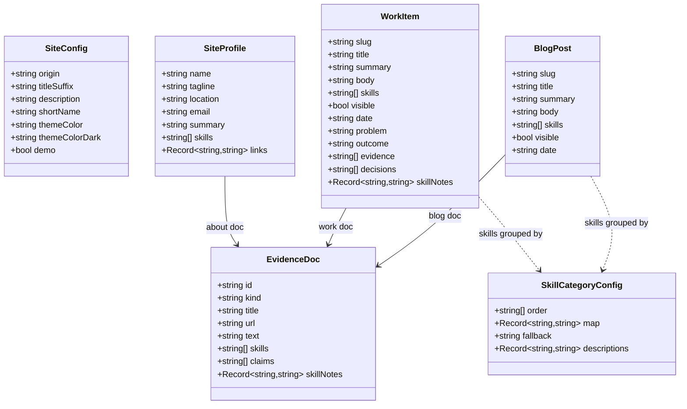

**Required vs optional.** `slug`, `title`, `summary`, `body`, `skills` are
required on work and blog. The editorial fields — `problem`, `outcome`,
`evidence`, `decisions`, `skill_notes` — are all optional, and the project
brief renders only the cells that exist, so a half-authored project degrades to
a shorter brief instead of empty headings.

**`outcome` and `evidence` are load-bearing.** They become `claims` on the
evidence doc: whole authored sentences, which Fit prefers as citations over a
text window cut from `body`. A project without them still works; its citations
are just weaker.

**The one hard structural rule:** `slug` must equal the filename stem.
`emit_site.py` exits non-zero otherwise, so a mistyped cross-link fails the
build rather than producing a dead internal URL.

**Cross-link grammar.** Bodies and summaries may contain
`{{work:slug|Label}}`, `{{blog:slug|Label}}`, or `{{post:slug|Label}}` (a blog
alias). These are parsed in `richText.tsx` and rendered as in-app links — never
as raw HTML, which keeps them CSP-safe. The same tokens are read by
`searchGraph.ts` to build real edges between documents.

---

## From YAML to a typed module

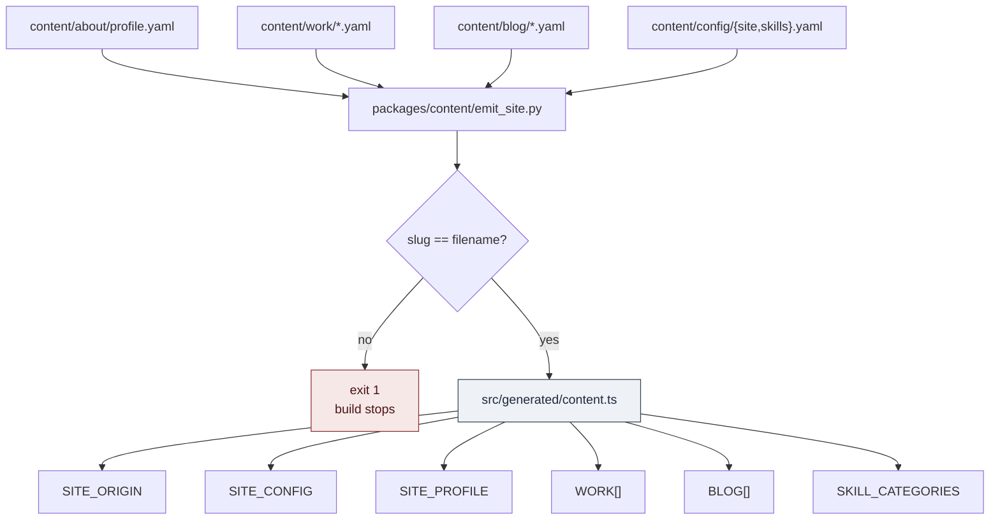

Emitting a **typed module** rather than splicing strings into a bundle means
`tsc` checks the content contract: change a field's shape in `types.ts` and the
next build fails at compile time rather than at runtime in a recruiter's
browser. Optional fields are omitted entirely rather than emitted empty, so
`w.outcome` is `undefined` and every consumer's falsy check works without a
length test.

The generator is Python, next to the YAML, so the site build doesn't take on a
Node YAML dependency.

---

## The build pipeline

`npm run build`, in `package.json` order.

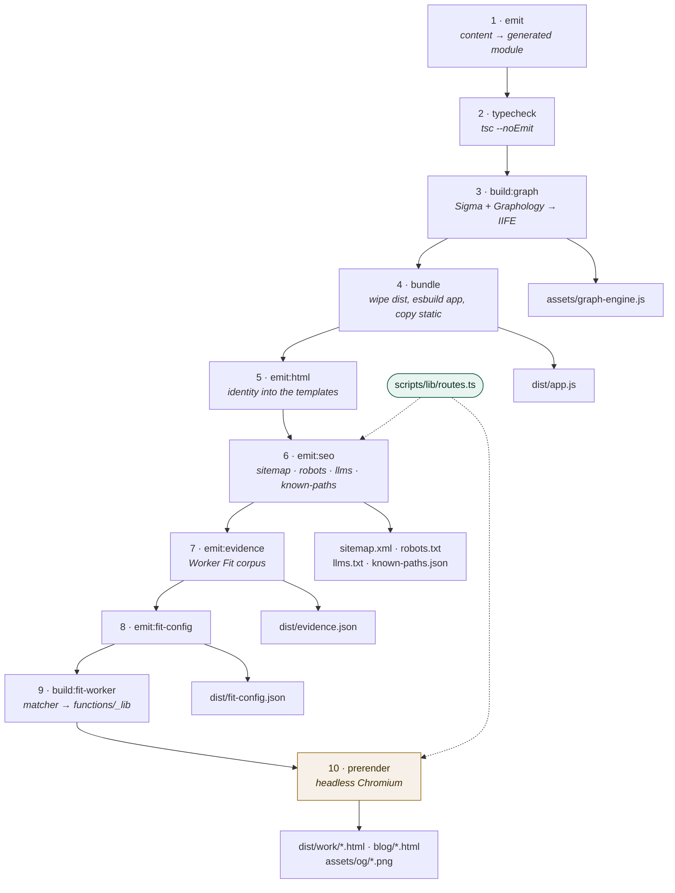

Three properties worth naming:

**`dist/` is wiped at step 4.** Route documents and social cards are named
after content slugs, so deleting a project used to leave its page behind,
served for a path no longer in the sitemap.

**One route table, two consumers.** The sitemap, `known-paths.json`, the
prerendered documents and the cards all derive from `scripts/lib/routes.ts`,
built from the same generated module the client router uses. They cannot drift,
because there is nothing to drift *from*.

**Authoring skips most of this.** `npm run dev` watches `content/`, `src/`
and `tokens/` and runs only the tier a change needs — ~2s for a work/blog edit,
~4s when identity changes, instant for CSS — and never prerenders. Prerendering
is a publish-time concern, so `npm run build` remains the thing you run before
deploying.

**Prerendering degrades loudly.** `run-prerender.mjs` treats a missing
Playwright as a warning locally — you get an SPA-only `dist` — and as a hard
failure when `PRERENDER_REQUIRED=1`, which CI sets. `seo-smoke` then enforces
all-or-nothing: once any route is prerendered, every indexable route must be.

---

## One corpus, five derivations

The same `content/` tree becomes five different structures. Nothing is authored
twice.

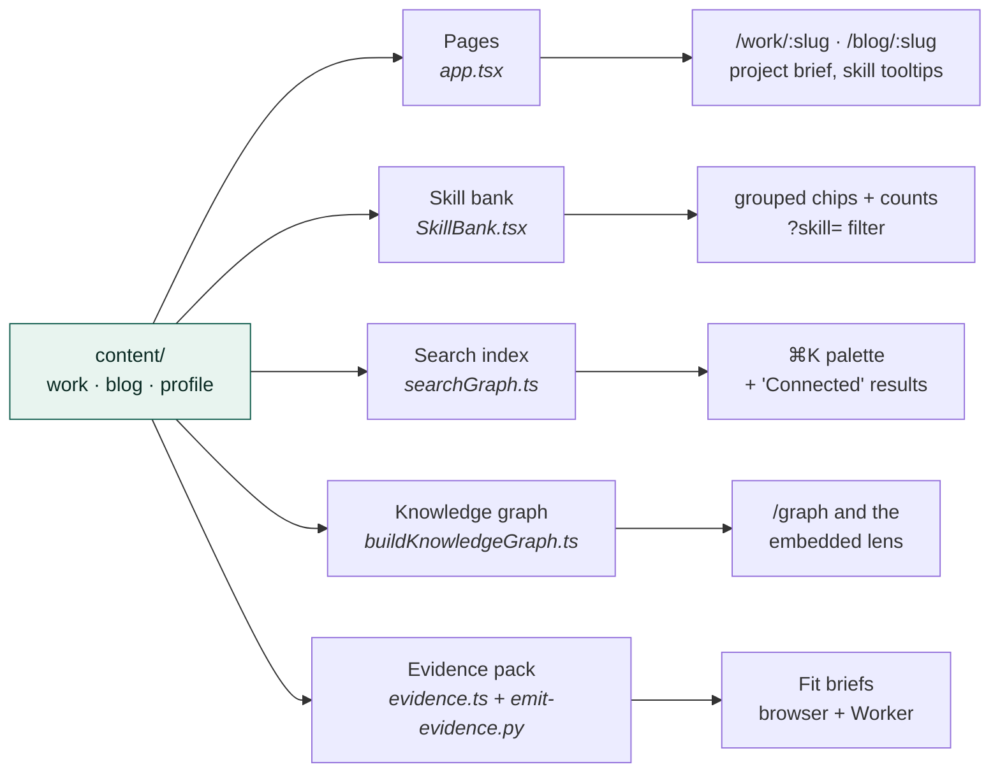

Each derivation reads `visible !== false`, so hiding a draft removes it from
all five at once.

---

## Runtime: routing and the client

The app is a hand-rolled SPA over vendored React — no framework, no router
library. A `View` is a discriminated union, and three pure functions map
between a view, a URL, and a document title.

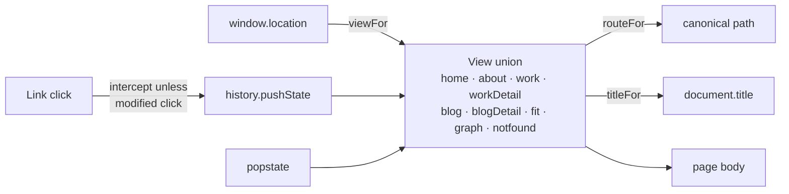

`Link` deliberately lets modified clicks through — ctrl/cmd/shift/alt or a
non-primary button falls back to native anchor behaviour, so "open in new tab"
works.

On every view change the app also updates `description`, `robots`,
`og:url`, and `<link rel="canonical">`. On a prerendered deploy those are
already correct in the served HTML; this keeps them correct after client-side
navigation.

---

## A request at the edge

Cloudflare Pages serves `dist/`. `functions/_middleware.js` runs on every
non-asset path.

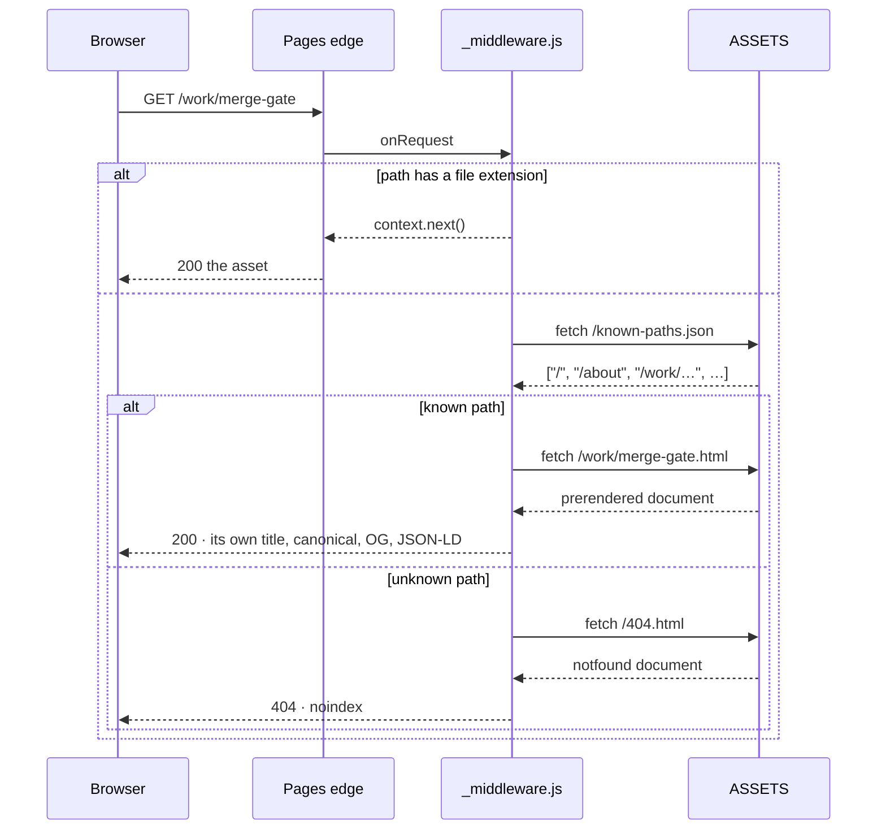

Two failure modes this exists to prevent:

- **Every unknown path returning 200.** The SPA fallback in `_redirects` makes
  every path "found", so Pages alone can never emit a real 404.
- **Every URL carrying the home page's metadata.** After prerendering,
  `index.html` *is* the home snapshot. Serving it for `/work/x` would hand a
  crawler the home canonical and title on every URL, discarding the entire
  point of prerendering.

If a build ran without prerendering, both branches fall back to the shell and
the site still works — just without crawler-visible per-route metadata.

---

## Fit

### Two implementations, one contract

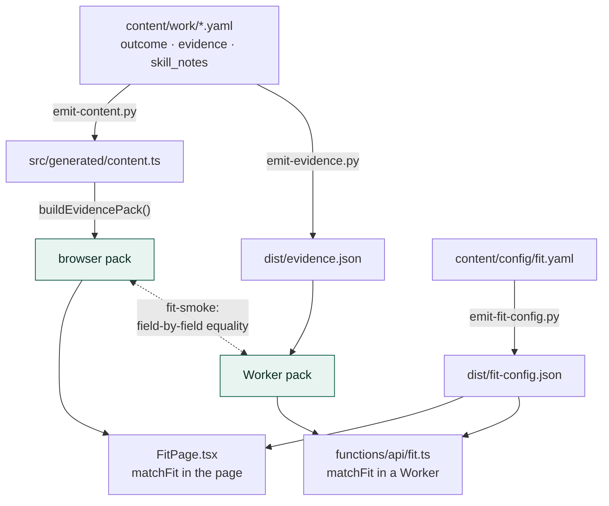

Two independent implementations of one contract — one TypeScript, one Python —
is a drift hazard, and they *had* already diverged once. `fit-smoke` compares
them field by field, including `claims` and `skillNotes`. The browser path works
with no network beyond the static config; `/api/fit` is optional and returns
the identical brief.

### The matcher

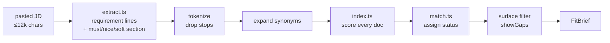

**Scoring** (defaults in `config.ts`, all overridable per tenant): a skill-tag
match is worth 14, a title match 8, a body match 6, times any `skillWeights`
multiplier. A doc must clear `minHit` 6 to be a hit at all; the top hit must
clear `partialMin` 10 to be partial and `alignedMin` 20 to be aligned.

**Status assignment:**

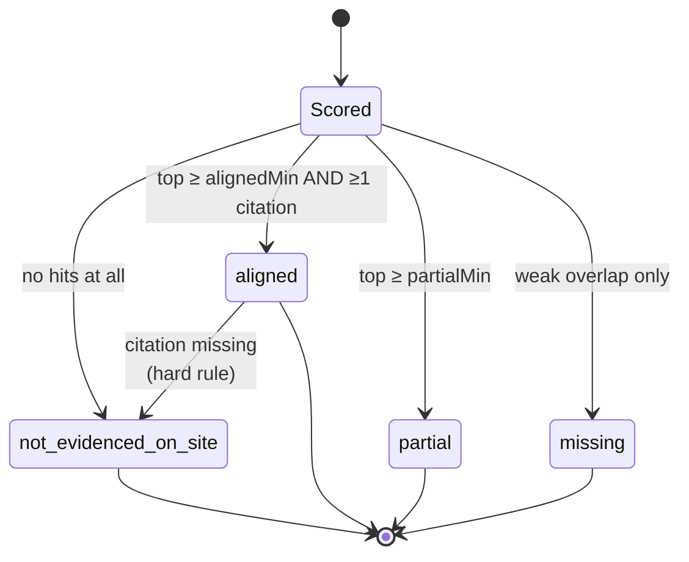

The `aligned → not_evidenced_on_site` transition is the cite-or-missing rule
made mechanical: a claim that lost its citation loses its status. `fit-smoke`
asserts it.

**Quote preference**, best first — a whole sentence is a citation, a tag is a
label:

| Rank | Source | Example |
|---|---|---|
| 1 | authored claim (`outcome` / `evidence`) | "Merges are blocked until the emitted content, the built bundle, and the deployed preview all agree." |
| 2 | `skill_notes[skill]` | "Delivery runs through merge gates rather than trusting a green local build." |
| 3 | bare skill tag | `CI/CD` |
| 4 | text window around the term | "…runs fit-smoke and build gates, and publishes…" |

Claim matching uses whole-token containment, not substring: a two-letter token
like `ci` (from splitting `CI/CD`) would otherwise match inside "de**ci**sions"
and outrank a relevant skill note.

**Surface modes.** `show_gaps` in fit.yaml (`showGaps` on the config object; default `false`) filters what the brief
*returns*; extraction and scoring always run in full. Highlight mode shows only
`aligned`/`partial` and swaps the second caveat to say the brief is not an
exhaustive review — so omitting rows never reads as a completed audit
(ADR 019).

---

## Search

⌘K / `/` opens a palette backed by its own graph — separate from the WebGL
knowledge graph, with a different node set and purpose.

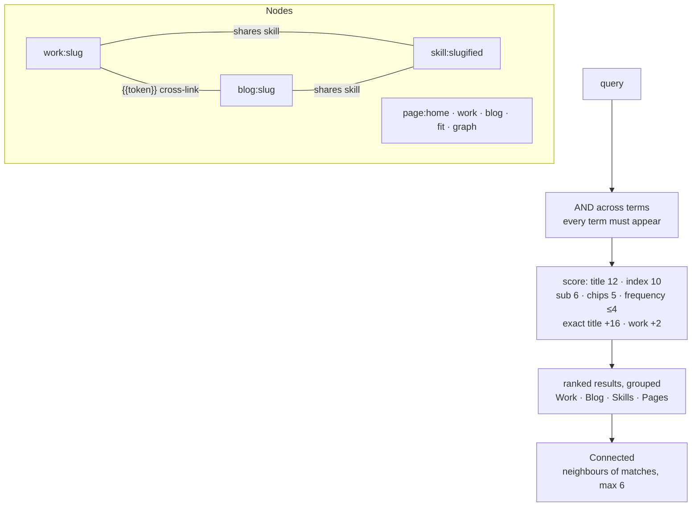

**"Connected" is the interesting part.** After ranking direct matches, the
palette walks one hop out along the edge map and offers neighbours the query
didn't literally match, labelled *via* the node that pulled them in. Searching
a skill surfaces the projects that use it; searching a project surfaces the post
that cross-links to it. That edge map is built from real `{{…}}` tokens and
shared skills, not from text similarity.

---

## The knowledge graph

A WebGL force-directed graph, rendered by Sigma over Graphology.

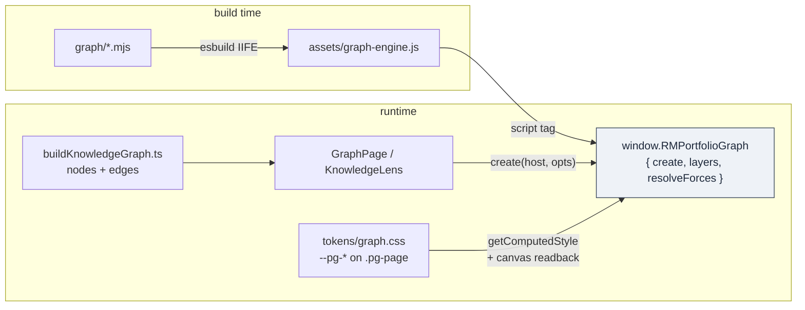

**Why a window global rather than an import.** The CSP is `script-src 'self'`
with no `unsafe-eval`; the engine is bundled to one self-hosted IIFE and
published on `window`, so React never bundles Sigma and the app degrades to a
quiet empty host if the engine is missing. `build-graph-vendor.mjs` fails the
build if `RMPortfolioGraph` isn't in the output.

**Three edge layers**, independently toggleable:

| Layer | Edge | Inferred? |
|---|---|---|
| `skills` | project → skill, post → skill | no — authored in `skills:` |
| `related` | project ↔ project sharing ≥1 skill | yes |
| `writing` | project ↔ post sharing ≥1 skill | yes |

**Theming crosses the boundary via CSS.** `theme.mjs` reads `--pg-*` custom
properties off the nearest `.pg-page` / `.work-graph-viewport` ancestor and
resolves any color syntax — including `oklch()` — through a 1×1 canvas
readback, because WebGL needs concrete hex. The palette is scoped to those
containers so the dark canvas never leaks into page chrome.

> **Known wart:** the knowledge graph uses `proj:` / `blog:` / `skill:` id
> prefixes while Fit evidence uses `work:` / `blog:`. Two id namespaces for one
> corpus. Adapters translate at the boundary; unifying them is unclaimed work.

---

## The design system

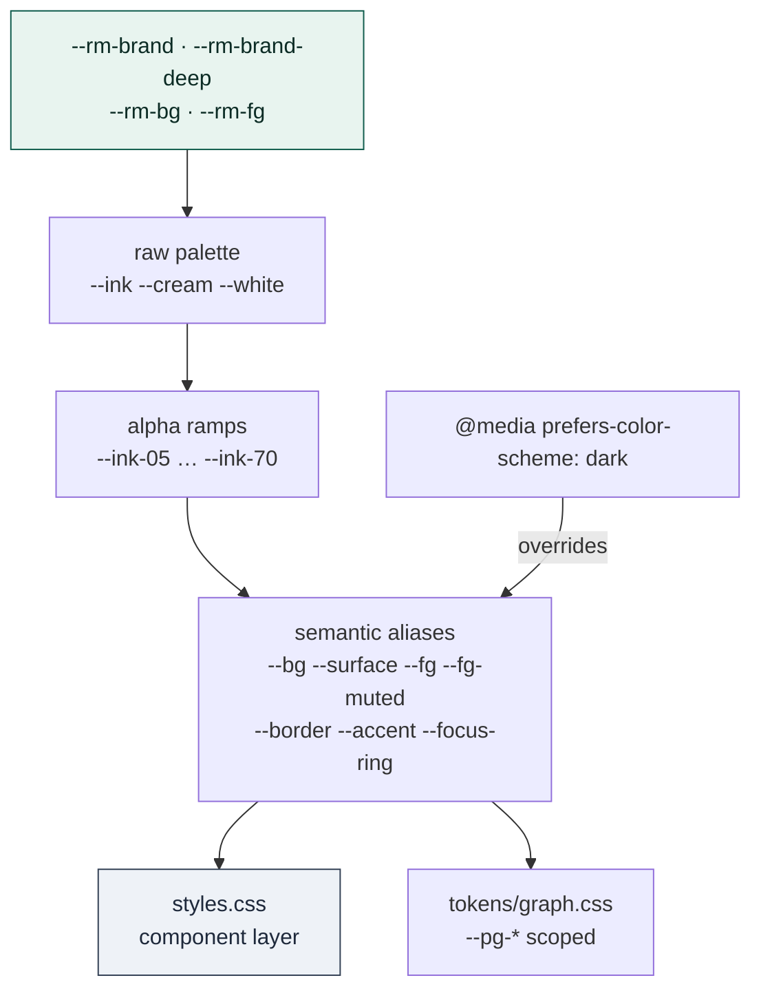

Four variables drive every color. The component layer never names one —
`check-style-tokens.mjs` fails on a raw hex in `styles.css` and on a
`var(--x)` no token defines, which is how a renamed token stops silently
painting from a fallback.

Contrast was measured rather than assumed: `--fg-muted` is pinned to 0.66
alpha rather than aliased to the `--ink-60` ramp step, because that step also
paints borders and lands under AA for 12–14px text. Every shipped
text/background pair clears WCAG AA in both schemes.

---

## Security model

| Surface | Posture |
|---|---|
| CSP | `default-src 'none'`; `script-src`/`style-src`/`font-src`/`connect-src` all `'self'`; `img-src 'self' data:`; `frame-ancestors 'none'`; `object-src 'none'` |
| Third-party JS | none. React is vendored under `assets/vendor/`; the graph engine is a self-hosted bundle |
| Webfonts | none. System font stack, so `font-src 'self'` is never exercised |
| Network at runtime | same-origin only: `/fit-config.json`, `/evidence.json`, optional `POST /api/fit` |
| Fit input | 12k character cap, 1 MB file cap, `.txt`/`.md` only; never persisted or transmitted in the browser path |
| Secrets | `check-secrets.py` scans the tree for 8 credential patterns; `prerender-routes.ts` independently re-scans every generated document before writing it |
| Identity leakage | `check-adopter-config.mjs` fails if your name/email appears in code |
| Demo corpus | `check-fictional-corpus.py` blocks real-person fingerprints *and* requires an obviously-fake persona while `demo: true` |

The demo persona is deliberately named **Fake Name**: every route now ships
prerendered `Person` JSON-LD, so an uncustomized demo deploy would otherwise
publish structured data asserting a plausible human exists.

---

## Gates and tests

```mermaid
flowchart LR
    A0["additive:check"] --> A00["parity:check"] --> A["corpus:check"] --> B["content:check"] --> C["secrets:check"] --> D["style:check"] --> E["build"]
    E --> F["config:check"] --> G["pages:check"] --> H["fit:smoke"] --> I["graph:smoke"]
    I --> J["seo:smoke"] --> K["csp:smoke"] --> L["ux:check"]

    style D fill:#eef2f7,stroke:#334155,color:#1e293b
```

| Gate | Fails on |
|---|---|
| `parity:check` | The Python and Node content resolvers disagreeing, on any of 15 questions across 7 adopter states. Where one fact must have two readers, this is what keeps them honest |
| `publication:check` | A guarded term appearing in your content or in `dist/`. Terms come from `corpus-guard.yaml` (committed), `corpus-guard.local.yaml` (gitignored) or `$RM_GUARD_TERMS` (CI) |
| `additive:check` | A file committed at an adopter path (it would have to be edited, and every template update would conflict); a missing demo fallback; `tokens/adopter.css` not imported last |
| `content:check` | A cross-link to a slug that doesn't exist (publishes a 404); a missing required field; a bad date; one skill spelled two ways. Warns on skills missing from `skills.yaml` |
| `corpus:check` | Real-person fingerprints in `content/demo/`; a persona name that isn't self-evidently fake; a non-`fake-` slug. Scoped by directory, so it needs no flag and never switches off |
| `secrets:check` | Private keys, `ghp_`/`gh[ours]_` tokens, `AKIA…`, Slack `xox…`, `sk-…`, Cloudflare tokens, and generic `api_key=`/`secret_key=` assignments |
| `style:check` | A raw color in `styles.css`, or a `var(--x)` no token defines |
| `config:check` | Your identity appearing anywhere under `src/`, `functions/`, `graph/`, or `public/` |
| `pages:check` | A GitHub Pages deploy that would land on a subpath and load blank; an `origin` that disagrees with where the site is actually served. Skipped while `demo: true` |
| `fit:smoke` | An `aligned` requirement with no citation; the two evidence packs disagreeing; a dequalifying status leaking into highlight mode; the non-exhaustive caveat going missing; audit mode losing the ability to report gaps |
| `graph:smoke` | A missing bundle; a bundle without `RMPortfolioGraph`/`create`; a regression to the retired `window.HHPG_FORCES` global; `resolveForces` ignoring `opts.forces`, the compact preset, or the defaults |
| `seo:smoke` | Sitemap/known-paths count mismatch; a 404 without `noindex`; an indexable route without its own document, canonical, or JSON-LD |
| `csp:smoke` | Anything the page does that its own Content-Security-Policy forbids, with the policy enforced; a meta CSP that is missing, wrongly present, or placed after the first stylesheet or script |
| `ux:check` | Text below WCAG AA against its real composited background; horizontal overflow; an undersized touch target that also fails the 2.5.8 spacing rule; no keyboard focus ring; a route without exactly one `h1`, a `lang`, or a title. 9 routes x light/dark x 375/1280px |
| `docs:check` | A number quoted in the docs that no longer matches source |
| `docs:links` | A relative doc link or in-page anchor that does not resolve |
| `check-ready` | Placeholder identity, an unreviewed draft, a published `TODO` → exit 1. Missing Python/PyYAML/`node_modules` → exit 2 |

Every one of these exists because it caught something real, not speculatively.

---

## Extension recipes

**Add a social platform.** Add a key under `profile.yaml` → `links`. The label
derives from the key, so `mastodon:` renders "Mastodon". Code change only if
the platform needs unusual casing (`profile-links.ts`).

**Add a project.** Drop `content/work/<slug>.yaml` with `slug` matching the
filename. It appears in the work list, skill bank, search index, knowledge
graph, sitemap, `llms.txt`, evidence pack, and gets a prerendered page with its
own OG card. No other file changes.

**Re-theme.** Change the four `--rm-*` vars in `tokens/colors.css`. Dark mode
follows automatically.

**Tune Fit.** `content/config/fit.yaml` — stop words, synonyms, per-skill
weights, score thresholds, caveats, and `show_gaps`.

**Add a route.** This one *is* a code change, in three places: the `View` union
and `viewFor`/`routeFor`/`titleFor` in `app.tsx`, and the route table in
`scripts/lib/routes.ts` so it reaches the sitemap and prerenderer.

**Add a drafting source.** `content/config/sources.yaml` plus a discovery agent
in `.claude/workflows/draft-content.mjs`. Note YouTube is a *link* today, not a
source: without captions or STT there is no grounded text to draft from, and
inferring claims from titles is exactly what the grounding phase prevents.

---

## Deployment

Cloudflare Pages, `dist/` as the output directory.

- Build command `npm ci && npm run build`, with **`PRERENDER_REQUIRED=1`** set
  so a deploy can never silently ship without prerendered documents.
- `_headers` and `_redirects` ship inside `dist/`.
- `functions/` deploys automatically as Pages Functions. `/api/fit` is
  optional — the browser path works without it. Bind KV `FIT_QUOTA` to enable
  the per-client daily cap.
- Prerendering needs Chromium in the build image:
  `npx playwright install --with-deps chromium`.

`npm run ready` answers "is this configured enough to deploy" before you try.

---

## Where decisions are recorded

Architecture here describes **how**. The ADRs carry **why**, including options
considered and rejected.

| ADR | Decision |
|---|---|
| [010–013](./docs/architecture/adr/) | Fit architecture, quota, security/data, CSP-safe graph |
| [014](./docs/architecture/adr/014-seo-aeo-baseline.md) | SEO baseline; why the 404 needed a middleware |
| [015](./docs/architecture/adr/015-design-token-system.md) | Design tokens, contrast floors, the drift gate |
| [016](./docs/architecture/adr/016-adopter-config-boundary.md) | Identity is data, never code |
| [017](./docs/architecture/adr/017-prerender-and-editorial-contract.md) | Prerendering, the editorial contract, one-command setup |
| [018](./docs/architecture/adr/018-build-command-and-source-drafting.md) | `/build-recruit-me`, grounded drafting, the links map |
| [019](./docs/architecture/adr/019-fit-highlight-mode.md) | Fit is a highlight, not an audit |

Full index: [`docs/README.md`](./docs/README.md).
