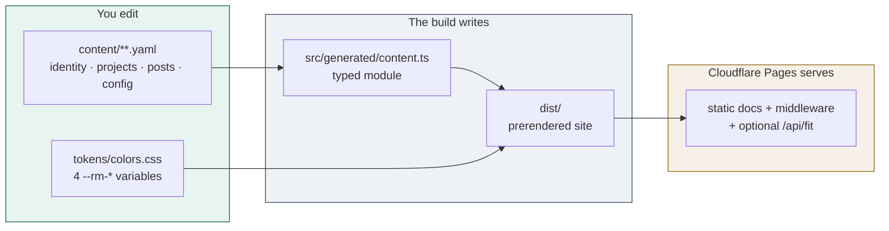
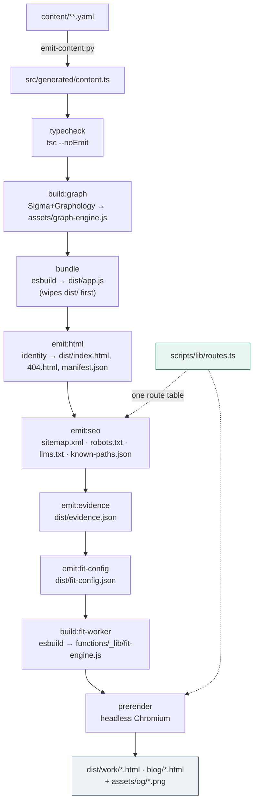
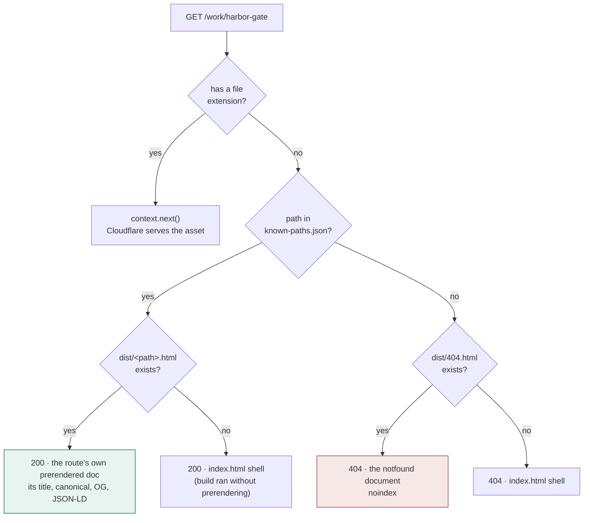
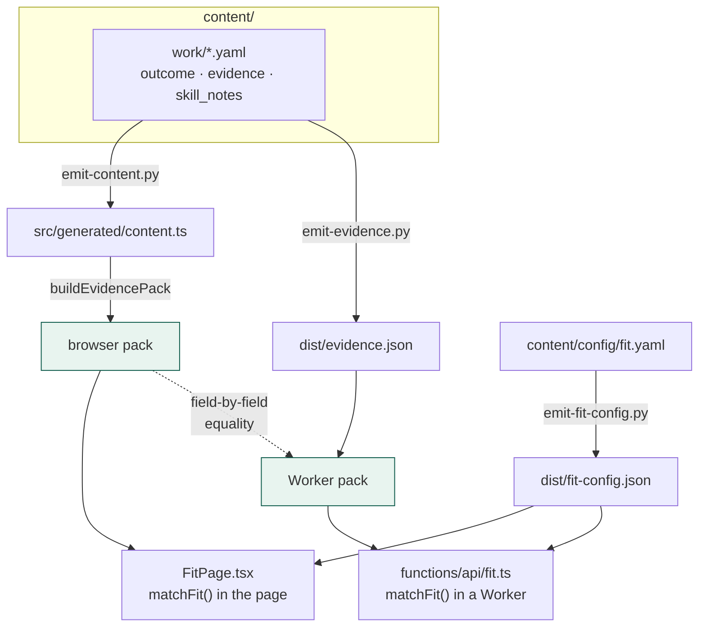
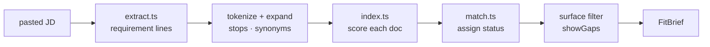
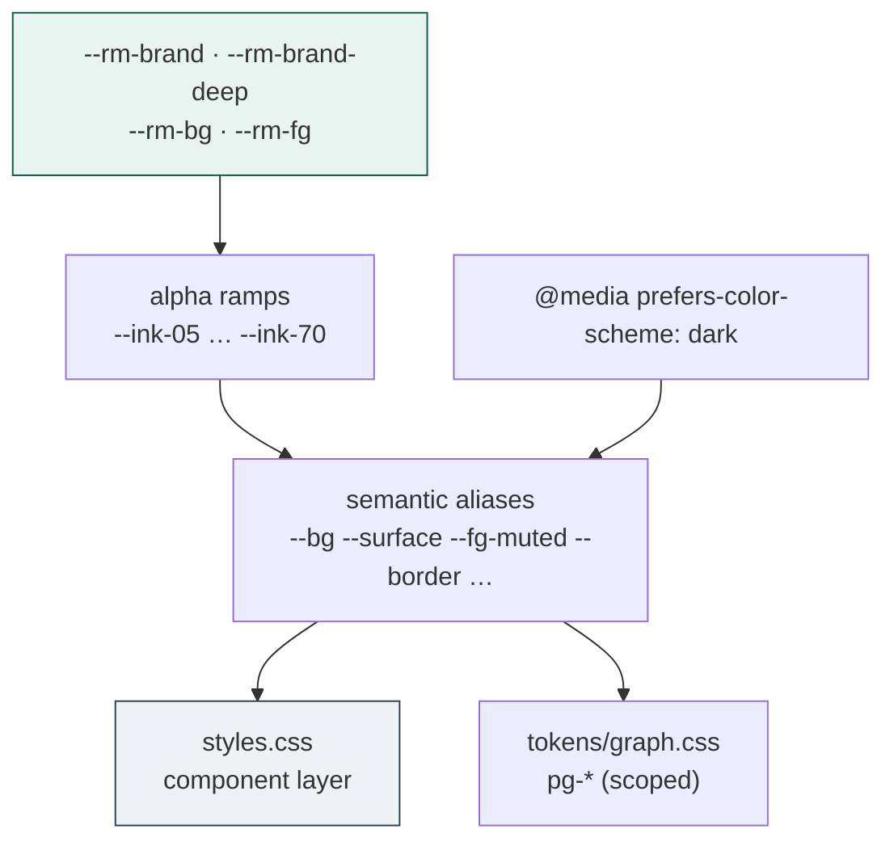

# Architecture

How recruit-me is put together, and why the seams are where they are.

If you only read one thing: **content is data, identity is data, and the build
is the only thing that writes code.** Everything below follows from that.

- [The model in one picture](#the-model-in-one-picture)
- [Directory structure](#directory-structure)
- [The build pipeline](#the-build-pipeline)
- [A request at the edge](#a-request-at-the-edge)
- [Fit: two implementations, one contract](#fit-two-implementations-one-contract)
- [The design system](#the-design-system)
- [Invariants and the gates that hold them](#invariants-and-the-gates-that-hold-them)
- [Where decisions are recorded](#where-decisions-are-recorded)

---

## The model in one picture



You never edit `src/`. A gate fails the build if your name leaks into it
(ADR 016).

---

## Directory structure

```
recruit-me/
├── content/                    YOUR DATA — the only thing you normally touch
│   ├── about/profile.yaml      name, tagline, email, skills, links{} by platform
│   ├── work/<slug>.yaml         one project each; problem/outcome/evidence/decisions
│   ├── blog/<slug>.yaml         one post each
│   └── config/
│       ├── site.yaml            origin, title suffix, theme colors, demo flag
│       ├── skills.yaml          skill-bank grouping + descriptions
│       ├── fit.yaml             Fit tuning: stops, synonyms, weights, showGaps
│       └── sources.yaml         optional: repos/resume for /build-recruit-me
│
├── src/                        THE APP — never contains your identity
│   ├── app.tsx                  router, page views, chrome
│   ├── generated/content.ts     ← emitted from content/. Do not hand-edit
│   ├── types.ts                 SiteProfile, SiteConfig, WorkItem, EvidenceDoc…
│   ├── profile-links.ts         platform key → display label
│   ├── fit/                     the matcher (see its own section)
│   ├── graph/                   knowledge-graph builder + React host
│   ├── search/                  ⌘K palette, cross-link token rendering
│   └── skills/                  skill bank + ?skill= filter
│
├── tokens/                     DESIGN SYSTEM — raw values live only here
│   ├── tokens.css               @import manifest (the entry point)
│   ├── colors.css               4 adopter vars → ramps → semantic aliases; dark mode
│   ├── typography.css spacing.css effects.css base.css
│   └── graph.css                pg-* palette, scoped to the graph surfaces
├── styles.css                  COMPONENT LAYER — reads tokens, never literals
│
├── scripts/                    THE BUILD
│   ├── lib/routes.ts            ★ the single route table
│   ├── lib/site-meta.ts         head tags + JSON-LD builders
│   ├── emit-content.py          content/ → src/generated/content.ts
│   ├── build.mjs                esbuild → dist/app.js, copy static
│   ├── emit-html.ts             identity into dist/{index,404}.html + manifest
│   ├── emit-seo-artifacts.ts    sitemap, robots, llms.txt, known-paths
│   ├── emit-evidence.py         dist/evidence.json (the Worker's Fit corpus)
│   ├── prerender-routes.ts      per-route HTML + 1200×630 social cards
│   ├── run-prerender.mjs        makes prerender optional locally, required in CI
│   ├── init-site.mjs            `npm run init` scaffolder
│   ├── check-*.{mjs,py}         the gates
│   └── banner.mjs               the wordmark
│
├── packages/
│   ├── content/emit_site.py     the actual YAML → TypeScript emitter
│   └── ingest/                  draft YAML from a resume / GitHub, for review
│
├── graph/                       WebGL engine (Sigma + Graphology), bundled
│                                to assets/graph-engine.js so CSP stays 'self'
├── functions/
│   ├── _middleware.js           404 status + serves the right prerendered doc
│   └── api/fit.ts               optional POST /api/fit
│
├── .claude/
│   ├── skills/build-recruit-me/ the /build-recruit-me command
│   └── workflows/draft-content.mjs   subagent drafting workflow
│
├── docs/architecture/adr/       why things are the way they are
├── index.html  404.html         templates; identity injected at build
├── _headers  _redirects         CSP and SPA fallback
└── dist/                        build output (gitignored)
```

---

## The build pipeline

`npm run build`, in order. Each step's output is the next step's input.



**Why `routes.ts` is dotted into two places.** The sitemap, `known-paths.json`,
the prerendered documents and the social cards are all derived from one table
built from the same generated module the client router uses. They cannot drift
apart, because there is nothing to drift *from*.

**Prerendering degrades, loudly.** `run-prerender.mjs` treats a missing
Playwright as a warning locally (you get an SPA-only `dist`) and as a hard
failure when `PRERENDER_REQUIRED=1`, which CI sets. A deploy can't silently
ship without it.

---

## A request at the edge

Cloudflare Pages serves `dist/`. `functions/_middleware.js` runs on every
non-asset path and decides two things: **what status** and **which document**.



Two failure modes this exists to prevent:

- **Every unknown path returning 200.** The SPA fallback makes every path
  "found", so Pages alone would never emit a 404.
- **Every URL carrying the home page's metadata.** After prerendering,
  `index.html` *is* the home snapshot. Serving it for `/work/x` would hand a
  crawler the home canonical and title on every URL — discarding the entire
  point of prerendering.

The CSP is `default-src 'none'` with everything `'self'`: React is vendored
under `assets/vendor/`, the graph engine is bundled to a self-hosted file, and
there are no webfonts. Nothing loads off-origin.

---

## Fit: two implementations, one contract

Fit runs in two places, and they must agree.



The dotted line is `fit-smoke`. Two independent implementations of one
contract — one TypeScript, one Python — is a drift hazard, and they *had*
already diverged once. The test compares them field by field, including
`claims` and `skillNotes`.

### Inside the matcher



Two rules the code enforces rather than intends:

- **`aligned` requires ≥1 citation.** Checked after status assignment, and
  asserted in `fit-smoke`.
- **Quote preference is ordered**: an authored claim (`outcome` / `evidence`) >
  a skill note > a bare skill tag > a text snippet. A whole sentence is a
  citation; a tag is a label.

`showGaps` (default `false`) filters the *surface*, never extraction —
requirements are always extracted and scored in full, because filtering earlier
would skew the ranking of what remains (ADR 019).

---

## The design system



Four variables at the top of `tokens/colors.css` drive every color. The
component layer never names one — `check-style-tokens.mjs` fails the build on a
raw hex in `styles.css`, and on a `var(--x)` that resolves to nothing.

---

## Invariants and the gates that hold them

Each of these exists because it caught something real.

| Invariant | Gate | Fails on |
|---|---|---|
| Identity is data, never code | `config:check` | Your name/email/title-suffix appearing anywhere under `src/`, `functions/`, `graph/`, or the HTML templates |
| The component layer is token-only | `style:check` | A raw color in `styles.css`; a `var(--x)` no token defines |
| The demo corpus stays fictional | `corpus:check` | Real-person fingerprints while `demo: true` — and a persona name that isn't self-evidently fake |
| No claim without a citation | `fit:smoke` | An `aligned` requirement with no evidence |
| The two Fit corpora agree | `fit:smoke` | Any field differing between the browser pack and `dist/evidence.json` |
| Highlight mode stays honest | `fit:smoke` | A dequalifying status leaking into the default surface, or the non-exhaustive caveat going missing |
| Prerendering is all-or-nothing | `seo:smoke` | An indexable route without its own document, canonical, or JSON-LD |
| A site is actually ready to ship | `check-ready` | Placeholder identity, an unreviewed draft, a published `TODO` (exit 1); a missing toolchain (exit 2) |

`npm test` runs: `corpus:check → secrets:check → style:check → build →
config:check → fit:smoke → graph:smoke → seo:smoke`.

---

## Where decisions are recorded

Architecture here is deliberately thin because the *reasoning* lives in ADRs —
including what was considered and rejected.

| ADR | Decision |
|---|---|
| [010–013](./docs/architecture/adr/) | Fit architecture, quota, security, CSP-safe graph |
| [014](./docs/architecture/adr/014-seo-aeo-baseline.md) | SEO baseline, and why the 404 needed a middleware |
| [015](./docs/architecture/adr/015-design-token-system.md) | Design tokens, contrast floors, the drift gate |
| [016](./docs/architecture/adr/016-adopter-config-boundary.md) | Identity is data, never code |
| [017](./docs/architecture/adr/017-prerender-and-editorial-contract.md) | Prerendering, the editorial contract, one-command setup |
| [018](./docs/architecture/adr/018-build-command-and-source-drafting.md) | `/build-recruit-me`, grounded source drafting, the links map |
| [019](./docs/architecture/adr/019-fit-highlight-mode.md) | Fit is a highlight, not an audit |

Full index: [`docs/README.md`](./docs/README.md).
