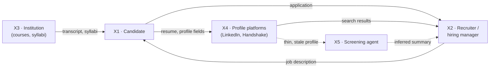
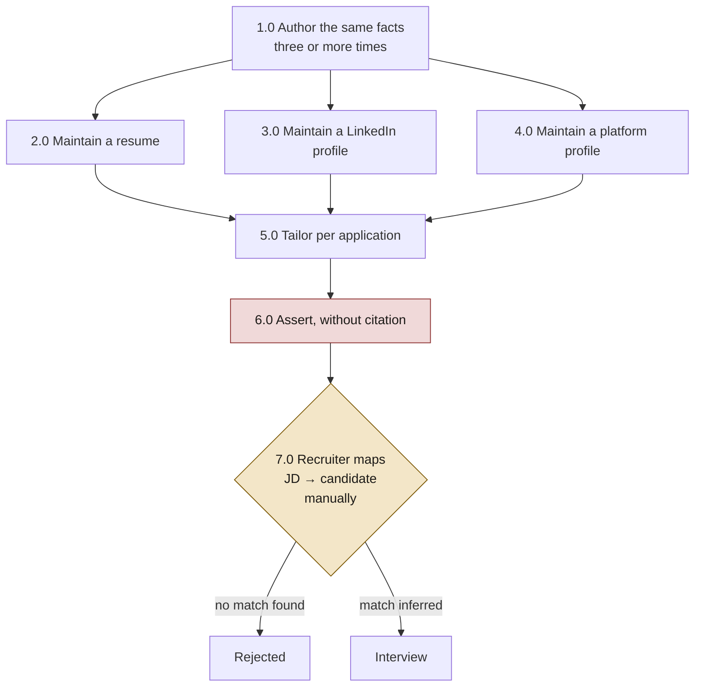
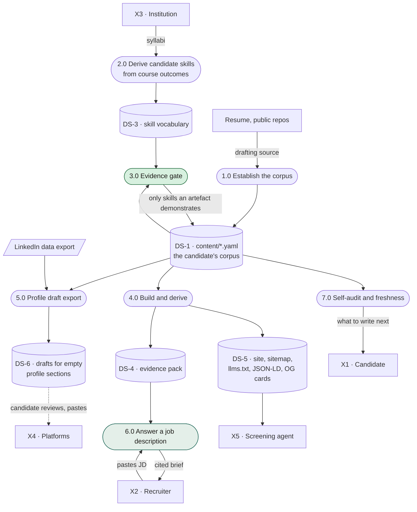
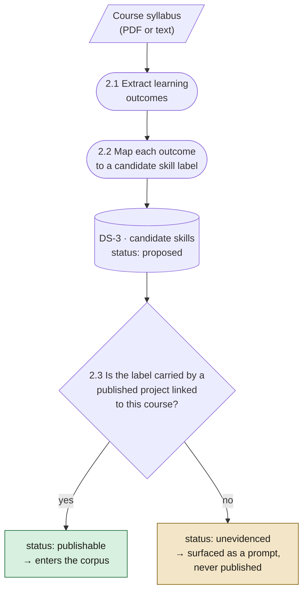
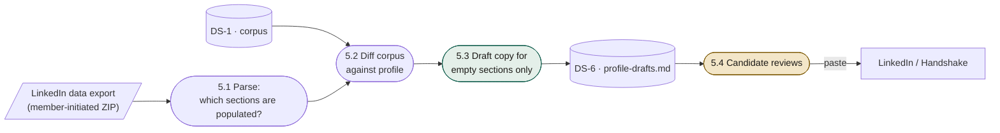

# Making a candidate legible: a field project, rebuilt for 2026

**Harrison Halperin** · 2026-08-20

> This document rebuilds a 2022 systems-analysis field project — *MIS 306,
> Student Internship System Redesign*, San Diego State University — on which I
> was one of five authors. The problem it identified was real and has not gone
> away. The solution it proposed has not survived four years of technology
> change, and the analysis in
> [`internship-system-review-2026-08.md`](./internship-system-review-2026-08.md)
> found that its business case does not survive recomputation either.
>
> What follows keeps the diagnosis, discards the mechanism, and proposes a
> different one. Where a figure is carried forward from the 2022 study it is
> labelled as the 2022 baseline; no 2026 measurement is invented to replace it.

---

## Executive summary

A student with two years of coursework, three built projects and a passing GPA
is, to a recruiter, indistinguishable from a student with none of those things.
Not because the work is absent — because it is illegible. It exists as a
transcript line, a folder of assignments, and a resume bullet that asserts
without citing.

The 2022 study measured the gap at San Diego State: **32 of 490 MIS majors
(6.5%) held a recognised paid internship, against roughly 941 postings open to
them — about two openings per student.** Supply was not the constraint. The
study's own diagnosis, which I still believe is correct, was that students
*"are unsure of how to state the skills they learned from courses they have
taken or they say the same thing in different ways,"* so the candidate pool
could not be narrowed.

The 2022 remedy was to standardise students into a marketplace: a mandatory
graded survey feeding Zapier, a SQL Server instance and an API that would
auto-populate Handshake profiles. It required $4,000 of setup, $1,334/month in
subscriptions, a department willing to stake 2–5% of every course grade on
compliance, and a write API from a vendor that had not agreed to provide one.

**This proposal inverts the dependency.** Every part of the 2022 design that
required institutional authority can be replaced by *reading a document the
institution has already published*. The department does not need to define a
skill taxonomy — it wrote one, in each course syllabus, the semester the course
was approved. The student does not need a platform's write API — the platform
already offers a member-initiated data export that says precisely which parts of
their profile are empty. The same move covers professional certifications: the
issuer publishes an exam guide naming, in its own words, the skills a passing
candidate is expected to have.

The proposed system is [show-your-work](https://github.com/rolefinder/show-your-work):
an MIT-licensed static site the candidate owns, built from a corpus they author
once and derive many times, with a deterministic matcher that answers a pasted
job description by citing pages they actually published. It adds three
mechanisms this document specifies for the first time:

1. **Curriculum-derived skill vocabulary.** Read the learning outcomes out of
   the syllabi for courses the student passed. Those outcomes are the
   institution's own written statement of what passing means, and they supply
   the vocabulary the 2022 study wanted a department to invent.
2. **Certifications as verifiable accolades.** A credential is the inverse case:
   whether you passed is independently checkable, while what you can *do* is
   not. Its published "Skills in" list joins the same vocabulary, its credential
   ID gives the site its one third-party-verifiable fact, and its expiry date is
   the only machine-readable decay signal in the whole corpus.
3. **Profile draft export.** Diff the corpus against a LinkedIn data export,
   find the sections that are empty, and draft copy for them from published
   projects — write-ups the candidate reviews and pastes.

No mechanism can publish a claim on its own. All three are governed by one rule,
which is the entire difference between this proposal and the one it replaces:

> **A skill may be published only when something the candidate published
> demonstrates it.**

The cost is **$0/month.** Not "low" — zero, and enforced: a build gate
(`free:check`) fails if a metered binding or a third-party fetch enters the
tree, because a person who forks a portfolio template must never be able to
receive an invoice for it.

---

## 1. What changed between 2022 and 2026

The 2022 design was a reasonable read of its moment. Four things have moved
since, and each one removes a dependency that design could not avoid.

| 2022 assumption | 2026 reality |
|---|---|
| Recruiters find candidates by searching a marketplace | Recruiters and their agents increasingly *read*. A machine-readable corpus — `llms.txt`, JSON-LD, an MCP endpoint — is a first-class distribution channel that did not meaningfully exist in 2022 |
| Publishing a real site needs hosting budget and ops | Static hosting with per-route prerendering is free and fits in a `git push` |
| Structured intake requires a form someone is compelled to fill | An agent can draft structured content from sources the candidate already has — a resume, public repositories, a syllabus — and ask only for what the source does not state |
| A skill taxonomy must be defined by an authority | The authority already wrote one — and publishes it. Every syllabus has a learning-outcomes section; every certification has an exam guide naming the skills it tests |

The fourth is the important one, and it is the pivot of this proposal. The 2022
study asked a department to build and maintain a canonical MIS skill list, then
persuade a vendor to expose it as a search filter. That list already exists,
distributed across the syllabi of the courses the department teaches, written by
the faculty who teach them, approved through curriculum review — and, for
anyone holding a professional certification, published by the issuer as a formal
exam guide. Nobody has to build it. It has to be *read*.

A fifth change is about the reader, not the technology. In 2022 the audience for
a candidate's material was a human skimming under time pressure. In 2026 it is
frequently a model — screening, summarising, or answering a hiring manager's
question about a shortlist. A model reading a portfolio will happily produce a
confident summary of a candidate from thin material. **That makes citation
infrastructure more valuable, not less:** the defence against a plausible
fabrication about you is a published page that says what is actually true, in
your words, reachable at a stable URL.

---

## 2. Business analysis

### 2.1 The problem, restated

The 2022 study framed the failure as a marketplace-filtering problem. I now
think that framing was one level too shallow. Underneath it are three distinct
defects, and only the first is about vocabulary.

**Defect 1 — The vocabulary is inconsistent.** A student writes "database
design" on a resume, "SQL" on LinkedIn, and "relational modelling" in a cover
letter, for one body of work. No search over that pool returns them reliably.
This is what the 2022 study measured and it is real.

**Defect 2 — The claim is uncited.** Every artefact in a job search asserts
without evidence. A resume bullet says a student can do a thing; nothing on the
page demonstrates it, and the recruiter's only options are to believe it, to
discount it, or to spend an interview slot finding out. The 2022 proposal did
not address this at all — its survey would have propagated unverified
self-assertions faster, which is a throughput improvement, not a credibility one.

**Defect 3 — The work is not addressable.** Coursework produces real artefacts —
schemas, analyses, working software — that live in a submission portal, a
private repository, or a laptop. There is no URL. A claim that cannot be linked
cannot be checked, and in 2026 it also cannot be *read by an agent*, which
increasingly means it does not participate in screening at all.

Defect 1 makes you unfindable. Defect 2 makes you unbelievable. Defect 3 makes
you unverifiable. The 2022 proposal attacked only the first, and it is the least
consequential of the three — being findable and unbelievable is not obviously
better than being neither.

### 2.2 Who this is for

The primary user is a student or early-career candidate: coursework rather than
employment, class projects rather than shipped products, no employer to cite and
no title to trade on. This is deliberately the hardest case. A senior engineer
with a decade of public work is already legible; the tooling matters least to
them.

The secondary user is the recruiter or hiring manager holding a job description,
who wants one question answered — *does this person's actual work bear on this
role?* — and who currently has to answer it by inference.

The third user is new since 2022: **an agent** acting for either party. It reads
the corpus through a structured endpoint rather than scraping rendered HTML, and
it is the reason machine-readable derivation is a requirement rather than a
nicety.

### 2.3 The 2022 baseline

Carried forward from the original study and labelled as such, because these are
the last figures I measured rather than assumed:

| Measure | 2022 value |
|---|---|
| MIS majors holding a recognised paid internship | 32 / 490 (6.5%) |
| Postings open to MIS majors on the university platform | ~941 (≈2 per student) |
| Students with a claimed platform account | ~15,000 / 35,000 (43%) |

The relationship between the first two rows is the finding that matters, and the
2022 study drew the wrong conclusion from it. It cited ~2 openings per student as
evidence that a 30% placement target was *feasible*. But those postings and those
students coexisted at a 6.5% placement rate — so posting supply was demonstrably
**not** the binding constraint, and abundance of supply is therefore not evidence
about the achievability of any target. The correct inference from the same two
numbers is the one this proposal starts from: **the loss is in the join, not in
the supply.**

---

## 3. The current system

### 3.1 Context



The dotted edges are the 2026 addition and the most dangerous part of the
current system: an agent summarising a thin profile produces a confident
characterisation of a candidate that the candidate never wrote and cannot
correct.

### 3.2 Where the effort goes



Three properties of this system are worth naming precisely, because the proposed
design is organised around removing them.

**The same facts are authored several times and drift.** There is no source of
record. A project written up well on LinkedIn and badly on a resume is two
versions of one truth, and the candidate maintains both by hand, forever.

**Tailoring escapes review.** Process 5.0 in the 2022 model — *"tailoring your
resume for the job description"* — edits the same artefact that was reviewed at
2.0, with no path back through review. Every per-application edit is unreviewed
by construction. That is a structural observation the original study's own data
flow diagrams made visible and its prose passed over.

**Nothing is falsifiable.** Process 6.0 produces claims with no attached
evidence. This is the defect the proposed system exists to close.

---

## 4. The proposed system

### 4.1 Shape

One authored corpus; many derived artefacts; one rule governing what may be
claimed.



Note what is absent. There is no server, no database of student records, no
scheduled job, and no credential held by anything but the candidate. Processes
1.0 through 4.0 and 7.0 run on the candidate's machine at build time. Process
6.0 runs in the recruiter's browser. Process 5.0 stops at a file the candidate
reads.

The 2022 design needed a $876/month SQL Server and a $340/month automation
service purely to move data between four vendors' products. In a single-repo
build system that tier does not exist: `content/*.yaml → emit → typed module` is
the same transformation, at build time, for nothing.

### 4.2 Process 2.0 — the curriculum is already written

**This is the first of the two new mechanisms, and it is the 2022 study's own
idea with its dependency removed.**

That study wanted students to *"choose from specific skill sets based on courses
they have taken so far,"* with the department defining the list. The dependency
was institutional: someone had to build the taxonomy, maintain it, and persuade
a vendor to expose it.

But the taxonomy is already written. Every syllabus contains a section of the
form *"Upon successful completion of this course, students will be able to…"*
That section is the institution's own, reviewed, published statement of what
passing the course means. It is a better source than the student's memory, and
unlike a memory it is attributable.



Configuration lives where every other adopter input lives — `content/config/sources.yaml`,
alongside the existing `github` and `resume` keys:

```yaml
syllabi:
  - course: MIS 315
    title: Database Management Systems
    term: "Fall 2021"
    file: ./syllabi/mis-315.pdf
    projects: [advising-schema-migration]
```

The parser joins `packages/ingest/` beside `from-resume-text.py` and
`from-github.py`, and obeys the same contract those already do: it writes drafts
as `visible: false`, and anything the source does not state becomes a `TODO:`
marker rather than a guess.

**What makes this safe is the branch at 2.3.** A syllabus establishes what the
course *taught*. It does not establish what the student *did*. Passing a
database course is not evidence of having modelled a schema, and a system that
treated it as evidence would be manufacturing exactly the uncited claims this
project exists to prevent.

So a syllabus-derived skill is a **candidate**, not a claim. It becomes
publishable only when a project in the corpus, linked to that course, already
carries the same label. The syllabus supplies the vocabulary; the artefact
supplies the evidence; neither is sufficient alone.

The unevidenced remainder is not discarded — it is the most useful output of the
whole process. A list that reads:

```
MIS 315 taught: SQL · data modelling · normalisation · transaction control
  published evidence: SQL, data modelling
  no evidence yet:    normalisation, transaction control
```

tells the student precisely what to write up next, drawn from work they have
already done. The 2022 system asked students to describe skills they could not
articulate. This one hands them the institution's own words and asks them to
point at the artefact.

### 4.3 Process 2.1 — certifications, where the evidence is reversed

A syllabus and a professional certification are the same kind of source: an
issuer publishing what it certifies. Reading either gives you vocabulary you did
not have to invent. But their evidential shape is exactly opposite, and that
difference is what decides how each may appear on the site.

A **syllabus** publishes what a course teaches. That document is public and
checkable. What is not checkable is whether you passed it — a transcript is
private, and "I took this course" is self-asserted.

A **certification** inverts both halves. Whether you passed *is* the checkable
part: a credential ID anyone can verify with the issuer, which makes it the only
fact in this entire system that does not rest on the candidate's word. What is
not checkable is whether you can do anything with it. An exam measures recall
under time pressure. The issuer is candid about this — AWS states that the target
candidate for the Solutions Architect – Associate has "at least 1 year of
hands-on experience designing cloud solutions that use AWS services," which
frames the hands-on work as a *prerequisite* the exam assumes rather than
something it verifies.

So each source is missing precisely what the other has, and in both cases the
artefact is what completes it.

**What the issuer actually publishes.** AWS's exam guide decomposes into four
weighted domains, each into task statements, and each task statement into two
labelled lists:

```
Task Statement 1.1: Design secure access to AWS resources

  Knowledge of:
    - AWS federated access and identity services (for example, IAM)
    - The AWS shared responsibility model

  Skills in:
    - Applying AWS security best practices to IAM users and root users
    - Designing a flexible authorization model that includes IAM users,
      groups, roles, and policies
```

The issuer has already done the classification we would otherwise have to do by
hand. **"Knowledge of" is what you know; "Skills in" is what you can do.** Only
the second becomes a candidate skill label. The first is discarded — being able
to describe the shared responsibility model is not a thing anyone shipped.

**Three tiers, with different rights.**

1. **The credential is an accolade.** Issuer, name, code, date earned, expiry,
   and a verification link. It renders alongside education, and it is the tier
   this proposal previously had no home for — a place on the site for the thing
   itself.
2. **The "Skills in" bullets are candidate vocabulary**, gated by exactly the
   subset rule coursework answers to. AWS asserting that a certified architect
   can design an authorization model is not evidence that *you* designed one.
3. **The labs are work entries.** A certification you earned by building as you
   went produces artefacts, and those are what carry citations.

Tier three is where the value concentrates, and it is why a hands-on
certification is worth more here than an exam-only one: it arrives with tier
three already populated. The schema should make that asymmetry visible rather
than flatten it.

```yaml
slug: aws-saa-c03
issuer: Amazon Web Services
name: AWS Certified Solutions Architect – Associate
code: SAA-C03
earned: "2026-03"
expires: "2029-03"
credential_id: ABC123DEF456
verify_url: https://cp.certmetrics.com/amazon/en/public/verify/credential

# Parsed from the issuer's published exam guide, "Skills in:" only.
# Each must also appear on a linked project — the gate enforces it.
skills:
  - IAM authorization design
  - VPC network design

projects:
  - multi-account-iam-baseline

visible: true
```

**One property certifications have that nothing else in the corpus does: a
machine-readable expiry.** Section 4.7 argues for staleness detection and notes
that every other content type forces you to *infer* decay from a date. A
certification states it. That makes `expires:` the first legitimate consumer of
a time-based gate — not a heuristic about whether a project feels old, but a
fact the issuer published. A lapsed credential should stop presenting itself as
current, and unlike everything else here, the build can know.

**Should a certification be citable in a Fit brief?** My recommendation is no,
and the reasoning is worth stating because the opposite case is respectable.

Against: a certification title is a bag of generic tokens — "Solutions",
"Architect", "Associate", "Cloud", "Developer". That is the precise failure mode
already documented in this codebase, where a skill tag reading `design systems`
made a *Rust systems programming* requirement come back aligned. A credential
name is that hazard with a vendor's marketing attached. And the route into Fit
already exists and is better: the gated skills live on the projects, and a
project is the stronger citation anyway.

For: a verifiable credential genuinely is different in kind from a self-asserted
skill tag. It is the one item on the site a recruiter could check without
trusting the candidate at all. If you wanted it citable, the honest construction
is a whole authored sentence — "Holds AWS Certified Solutions Architect –
Associate, credential ABC123, verifiable at the issuer" — entering the evidence
pack as a claim while the title stays out of the matchable text, so the
collision surface stays closed and the citation stays a full sentence.

That is a bigger change than it looks. It would put something into the evidence
pack that is not the candidate's own work for the first time, and the governing
rule would widen from *every citation traces to work you did* to *…or to a
credential someone else issued and still vouches for*. That is a defensible
rule. It is simply not the current one, and it should be adopted deliberately or
not at all.

### 4.4 Process 3.0 — the evidence gate

One rule, enforced at build time rather than intended:

> **A course may only claim a skill that one of its own linked projects already
> claims.**

Three consequences follow without further machinery. Courses introduce no new
labels into the skill vocabulary, so the existing one-spelling rule
(`content:check` refuses to ship a skill spelled two ways) covers them for free.
Courses introduce no new documents into the evidence pack, so no citation can
ever resolve to a syllabus — the citation is always the project. And a course
cannot appear on the site at all unless it produced something published.

That last property is the thesis of the whole project applied to coursework:
*show your work.* A transcript line is not a portfolio entry. A transcript line
attached to a schema you built and published is.

### 4.5 Process 5.0 — profile draft export

**This is the second new mechanism: populate the platform profile, from the
corpus, where the profile is empty.**

The 2022 design did this with a write API — Power Automate pushing fields into
Handshake. That path is closed here, and I want to be direct about why rather
than quietly omitting it. It requires storing a credential for an account the
candidate owns; it requires a runtime fetch to a third-party host, which
`free:check` fails; and it puts the candidate's own account at terms-of-service
risk during a job search, which is the worst possible time to have a profile
restricted. The 2022 plan also never obtained the API it depended on — its
implementation plan lists *"reach out to Handshake and request licensing
permissions"* as a task, with no fallback if refused.

The goal survives the removal of that mechanism, because the hard part was never
the transport. It was the writing. A candidate with an empty LinkedIn "About"
section is not blocked by the absence of an API; they are blocked by not knowing
what to put there.



The export ZIP is the piece that makes *"if it's not populated"* answerable
without reading anyone's account. It is member-initiated, explicitly permitted,
and already the path this project's PRD selected over scraping. It states which
sections are empty, so the export can target the gaps instead of overwriting
work the candidate has already done well.

The drafting obeys the corpus contract exactly. An "About" paragraph is
assembled from `profile.summary` and the outcomes of published projects. An
Experience description is assembled from that role's `highlights`. A Projects
entry is assembled from a project's `problem` and `outcome`, with its public URL
attached. **Every sentence traces to a line the candidate already wrote and
published.** Nothing is generated to fill space, and anything the corpus does not
state emits a `TODO:` rather than an invention.

Configuration sits beside the syllabi key:

```yaml
linkedin_export: ./linkedin-export.zip   # optional; drafts target empty sections
```

The output is a file. The candidate reads it, edits it, and pastes what they
want. **The system stops at the clipboard, not the credential** — and that
boundary is a feature, because the last review before something becomes a public
claim about a person should be performed by that person.

### 4.6 Process 6.0 — answering the job description

This is the existing Fit surface and it is unchanged by this proposal, but it is
where the preceding work pays out, so it belongs in the flow.

A recruiter pastes a job description. A deterministic keyword matcher — no model
in the matching path — retrieves evidence from the published corpus and returns
a brief in which every `aligned` requirement carries at least one citation
quoted verbatim from a real page. A requirement with no citation cannot be
`aligned`; it is demoted, and a build gate asserts this rather than trusting it.

The matcher cannot fabricate an employer, a date or a metric, because it can only
quote strings that already exist in `content/`. That property is what the 2022
design had no analogue for, and it is the reason the vocabulary work in 2.0 is
worth doing: a controlled vocabulary that produces uncited matches makes a
candidate findable and unbelievable at once.

### 4.7 Process 7.0 — self-audit and freshness

The 2022 study's sharpest observation was about decay: *"students who do use
[the platform] may not actively maintain and update their profile."* Its remedy
was a graded mandate re-run every semester — an institutional lever that does not
exist for someone who forked a repository.

The detection, though, transfers cleanly, and it turns out the matcher already
computes the answer and throws it away. Every requirement in every brief is
evaluated and assigned a status; the rows that found no evidence are filtered out
before display. Run the same matcher over saved job descriptions locally and the
discarded half becomes the candidate's work queue:

```
19 requirements · 6 aligned · 4 partial · 9 uncited
uncited: "experience with container orchestration"
         "familiarity with incident response"
```

That is the 2022 study's measurement discipline — a baseline and a target with a
denominator — recovered without a single analytics beacon. It runs locally, over
the candidate's own corpus, and reports to nobody.

Freshness is the same shape: warn when the newest dated entry in the corpus
passes a threshold. Not a build failure — a stale site still works, it just works
worse.

---

## 5. Solution assessment

### 5.1 Operational feasibility

The system asks the candidate for one thing the 2022 design also asked for —
write up your work — and removes almost everything else. There is no account to
claim, no form to submit on a schedule, no compliance to police, and no third
party whose cooperation is required before anything functions.

The honest objection is that authoring is real work, and this proposal does not
pretend otherwise. Writing a project to the editorial contract — problem,
outcome, evidence, decisions — takes longer than ticking a skill checkbox. The
defence is that it is the *only* work in the system that cannot be automated,
because it is the part that constitutes the evidence. Everything downstream of it
is derivation.

Two mechanisms reduce the blank-page cost, and both are already the house
pattern: a single batched interview at setup rather than a trickle of prompts,
and drafting from sources the candidate already has — now including syllabi and
a LinkedIn export.

### 5.2 Technical feasibility

Every component exists and is running. The site builds, prerenders per route,
ships a strict content-security policy with no CDN dependency, and passes
eighteen build gates including the citation invariant. The two new mechanisms are
additive: a parser in an existing package, two optional keys in an existing
config file, one new corpus directory, and one new rule in an existing gate.

Nothing proposed here requires a vendor to agree to anything — which is the
single largest difference in risk profile from the 2022 plan, whose entire
architecture terminated in an unconfirmed API.

### 5.3 Schedule feasibility

The 2022 plan needed one to two semesters and a development team before the first
student benefited. This one is incremental, and the base system is already live,
so each piece ships independently:

| Piece | Scope |
|---|---|
| Syllabus parser + `syllabi:` key | A parser, an ingest contract already specified |
| `content/courses/` + evidence gate | One corpus directory, four gate rules, three copy-pasted from existing loops |
| Profile draft export | Export parser, diff, template emitter |
| Self-audit + freshness | Reuses the matcher; a warning, not a blocker |

### 5.4 Economic feasibility

The 2022 study built its case on a $298,839/month expected value, a 223% ROI and
a $2,694,264 net present value. Recomputation retired all three: the ROI is a
ratio of 223× with a percent sign appended; the NPV reproduces to within $2 as
one year of gross benefit discounted three years with no costs subtracted; and
the benefit was student wages, which accrue to students and are paid by
employers, while the costs fell on the university. The entity paying received
none of the return.

I am not going to replace those numbers with better-looking ones. The honest
economics of this proposal are short:

| Item | Cost |
|---|---|
| Hosting | **$0** — static hosting on a free tier |
| Software | **$0** — MIT licensed, self-hosted, no runtime dependency on any vendor |
| Institutional buy-in | **None required** |
| Candidate's time | The real cost: an evening to establish a corpus of three written-up projects, and well under an hour per term to keep it current *(estimate, not a measurement)* |

The zero is enforced rather than promised. A build gate fails if a metered
binding or an absolute third-party fetch enters the tree, for a stated reason:
the person who forks a portfolio template must not be able to receive an invoice
for it.

That constraint is also what makes the comparison meaningful. The 2022 system's
$1,334/month bought data movement between four vendors. Removing the vendors
removes the cost entirely rather than reducing it — and on that study's own
analysis, the effect it hoped for was carried by the graded mandate, which was
free, and not by the software, which was not.

### 5.5 What this does not solve

Stated plainly, because the 2022 document's weakest passages were the ones that
claimed too much.

**It does not make you discoverable.** This system answers a recruiter who has
arrived. It does not put you in front of one who has not. Machine-readable
surfaces and search indexing help; they are not a marketplace, and no amount of
citation discipline substitutes for applying to jobs.

**It does not make you qualified.** A citation proves you published a claim, not
that the claim is true or that the work was good. Provenance is not veracity, and
this system guarantees only the first.

**It cannot represent duration.** A requirement for "5+ years" is not something a
keyword matcher can evaluate, and a brief will not pretend otherwise.

**It cannot tell you whether it worked.** There are no analytics, by design — the
job description never leaves the recruiter's browser. The candidate can measure
their corpus coverage locally; they cannot measure recruiter behaviour. That is a
deliberate trade of measurement for privacy, and it should be named as a trade
rather than presented as a feature.

---

## 6. Implementation plan

1. **Syllabus ingest.** Parser in `packages/ingest/`, `syllabi:` key in
   `sources.yaml`. Emits candidate skills as reviewable drafts.
2. **`content/courses/` and the evidence gate.** The corpus directory, the
   subset rule in `check-content.py`, and an assertion that courses never enter
   the evidence pack — the safety property should be tested, not assumed.
3. **`content/certifications/` and the exam-guide parser.** Same corpus shape and
   the same subset gate, plus `"Skills in:"` extraction and an `expires:` check.
   Ships after courses because it reuses that gate wholesale.
4. **Profile draft export.** LinkedIn export parser, diff against the corpus,
   templates for About / Experience / Projects. Output is a file for review.
5. **Self-audit and freshness.** `fit:audit` over saved job descriptions; a
   staleness warning in the readiness check. Read the date from the YAML, not
   from filesystem timestamps — a fresh clone rewrites those and would report
   everything as stale.
6. **Record the decisions.** The courses corpus needs its own decision record,
   which must state that it deliberately does not revisit the existing exclusion
   of education from the evidence pack.

Sequenced so that each step is independently useful: syllabus ingest is worth
having before courses exist, and the audit is worth having before either.

---

## 7. Conclusion

The 2022 field project asked what it would take to make 490 students legible to
recruiters, and answered: a department with a budget, a mandate over its
students, four commercial products, and a write API from a company that had not
agreed to provide one.

Four years later the honest answer is smaller. Most of what that design needed to
build already exists in written form, unread. The skill taxonomy is in the
syllabi. The profile gaps are in the data export. The evidence is in the
coursework, unaddressable only because nobody published it. And the hosting that
would have cost $1,334 a month costs nothing.

What does not get cheaper is the writing. Someone has to say what the problem
was, what they built, what happened, and what they would do differently — and no
part of this system can do that for them, because that sentence *is* the
evidence. Every mechanism proposed here exists to make sure that when a candidate
writes it, it goes to work in every place it is needed, and that nothing which
was never written can be claimed on their behalf.

The 2022 study's diagnosis was right: students say the same thing in different
ways, and it makes them impossible to find. Its treatment tried to fix the
candidate's words. This one fixes what the words are attached to.

---

### References

Halperin, H. *Review — an internship-system redesign, and what transfers.*
[`internship-system-review-2026-08.md`](./internship-system-review-2026-08.md),
2026 — recomputation of the 2022 study's figures and the constraint analysis
underlying §4.4 and §5.4.

*Student Internship System Redesign*, an unpublished undergraduate
systems-analysis field project, Fall 2022 — source of the 2022 baseline figures
in §2.3 and the diagnosis quoted in the executive summary. The author was one of
its contributors; his co-authors are not named here, and the critique of that
document's business case in the companion review addresses the analysis rather
than any individual.
